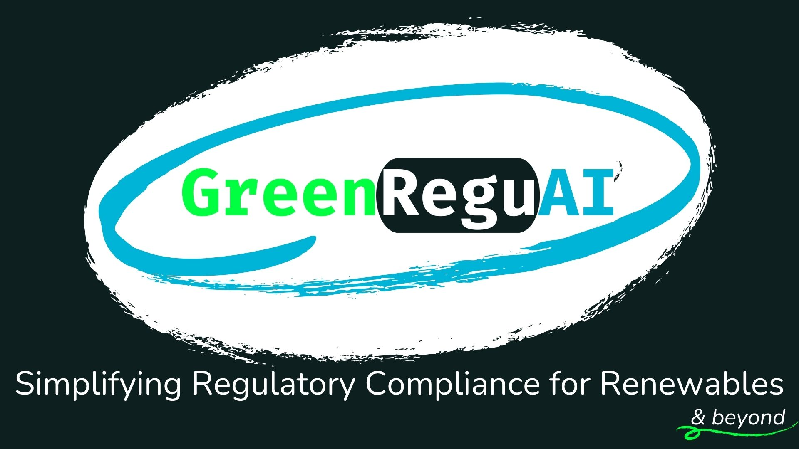

# GreenReguAI

GreenReguAI is an AI-powered platform that provides companies in the renewable energy sector with an accessible, up-to-date repository of global laws and regulations. The platform uses advanced language models to help users navigate complex regulatory frameworks through a natural language interface.

### Watch a 1-min video presentation clicking the image below:

[](https://www.youtube.com/watch?v=F8rSHf1doeo)

## Features

- 🤖 AI-powered chat interface for regulatory queries
- 📚 Comprehensive database of renewable energy laws and regulations
- 🔍 Direct linking to source documents and specific sections
- 🌐 Support for original language documents
- 💳 Credit-based system with initial free credits
- 🔒 Secure authentication and user management

## Getting Started

### Prerequisites

- Node.js (v16 or higher)
- Python 3.9+
- npm or yarn
- Supabase account
- Pinecone account
- OpenAI API key (for embeddings)

### Installation

1. Clone the repository:

```bash
git clone https://github.com/yourusername/greenreguai.git
cd greenreguai
```

2. Install frontend dependencies:

```bash
cd frontend
npm install
```

3. Install backend dependencies:

```bash
cd backend
pip install -r requirements.txt
```

4. Set up environment variables:

Create a `.env` file in both frontend and backend directories with the necessary environment variables.

Frontend (.env):

```
REACT_APP_SUPABASE_URL=your_supabase_url
REACT_APP_SUPABASE_ANON_KEY=your_supabase_anon_key
REACT_APP_STRIPE_PUBLIC_KEY=your_stripe_public_key
```

Backend (.env):

```
SUPABASE_URL=your_supabase_url
SUPABASE_SERVICE_KEY=your_supabase_service_key
OPENAI_API_KEY=your_openai_api_key
PINECONE_API_KEY=your_pinecone_api_key
PINECONE_ENVIRONMENT=your_pinecone_environment
STRIPE_SECRET_KEY=your_stripe_secret_key
```

### Running the Application

1. Start the frontend development server:

```bash
cd frontend
npm start
```

2. Start the backend server:

```bash
cd backend
uvicorn main:app --reload
```

The application will be available at http://localhost:3000

## Architecture

- Frontend: React.js with Redux for state management
- Backend: FastAPI (Python)
- Databases:
  - Supabase (Primary database)
  - Pinecone (Vector database for semantic search)
- Authentication: Supabase Auth
- Payments: Stripe integration
- AI: LangChain framework with various LLM options

## License

This project is proprietary software. All rights reserved. Unauthorized copying, modification, distribution, or use of this software, via any medium, is strictly prohibited.

## Support

For support, please email greenreguai@outlook.com or open an issue in the GitHub repository.

## Acknowledgments

- Create React App for the initial project setup
- Supabase for the backend infrastructure
- OpenAI for embeddings
- LangChain for the AI framework
